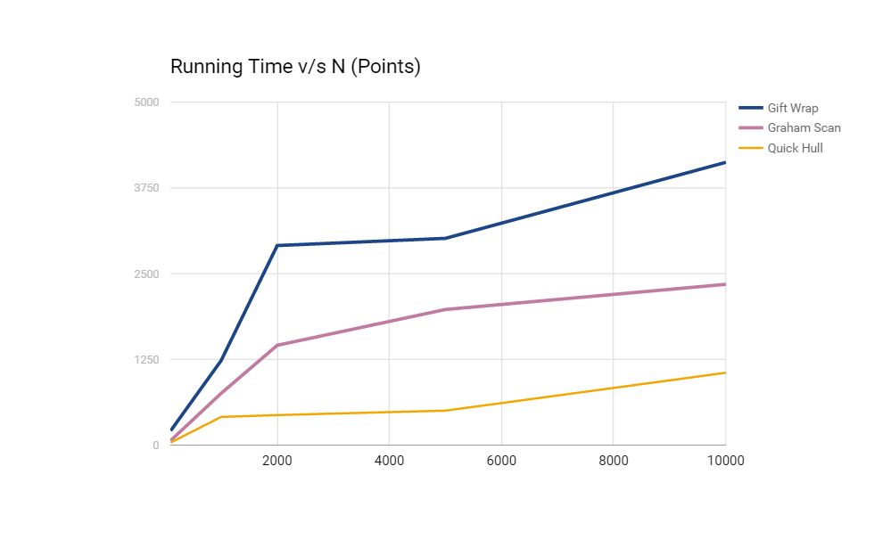
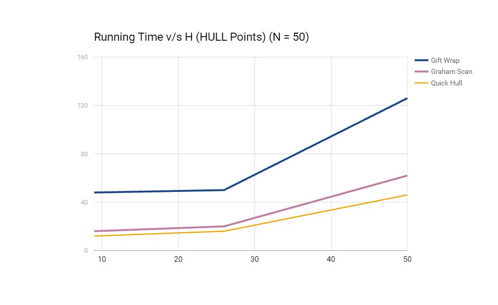

# Assignment 4  (Convex Hull Algorithms)  
[CSN- 212] [Assignment #4] This repository contains algorithms to find the 'Convex Hull' from a given set of points.  
  
## Problem  
Implement the following algorithms -
* GiftWrapping Algorithm
* GrahamScan Algorithm
* QuickHull Algorithm 
  
Also, plot a chart showing the running time vs n(points) & h(hull points)  
  
#### Solution -  
The graph shown below consists of 5 input test points (n) and the corresponding running times.  
NOTE : n = 100, 1000, 2000, 5000, 10000
  
  

The graph shown below consists of 3 different hull points (h) and the corresponding running times.  
NOTE: Number of points (n) is SAME in all 3.  
  
